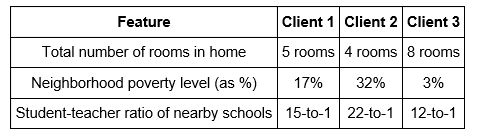

# Predicting_Boston_Housing_Prices
Language: Python (scikit-learn, pandas, NumPy)   
Skills: Machine Learning, Data Exploration  
Built Supervised Machine Learning models to predicting the probability that somebody will experience 
financial distress in the next two years. Received a score of 0.77 and the winner of the competition had a score of 0.87.   

  

And the predicted selling price for the houses are: 

- Client 1's house: $306,337.50 

- Client 2's house: $224,342.55 

- Client 3's house: $930,490.91
